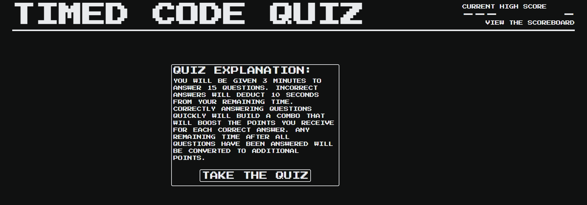

# Code-Quiz

## Description
This repository contains a webpage for a timed coding quiz. Upon clicking the "Take the Quiz" button, a timer begins and questions are presented in turn until 15 questions have been entered or time runs out. Combos are achieved by choosing consecutive correct answers within 15 seconds of the question being displayed, else the combo and points multiplier are reset. If an incorrect answer is chosen, 10 seconds are deducted from the time remaining. Any time remaining at the end of the quiz is converted to points and modified by whatever points multiplier the user has achieved. The top 10 scores are saved locally and can be viewed at any time.

Technologies used include HTML, CSS, and Javascript.

## Features
* 3 minutes are given to answer 15 questions
* Correctly answered questions increase the user's score
* Score is affected by a points multiplier that increases with each correctly answered question, but resets for incorrect answers
* A bar across the bottom of the quiz shrinks denoting the time left for combos and the points multiplier to be maintained
* Time is deducted for incorrect answers
* Incorrect answers, once clicked, vanish and cannot be clicked again

## Links

[Deployed website](https://wgrout87.github.io/Code-Quiz/)

[Code repository](https://github.com/wgrout87/Code-Quiz)

## Usage
This repository contains a timed code quiz webpage, which can be viewed on a variety of devices as it has been configured for multiple screen dimensions. The questions in this quiz are intended to help the user brush up on their programming knowledge.

The deployed website should resemeble the following screenshot.

## Credits
Questions for this quiz have been taken from the UofU Coding Bootcamp online course modules.

The fade-in effect animation used came from https://blog.hubspot.com/website/css-fade-in.

Osman, Maddy. “How to Add a CSS Fade-in Transition Animation to Your Text, Images, Scroll &amp; Hover.” HubSpot Blog, 8 Oct. 2021, https://blog.hubspot.com/website/css-fade-in.